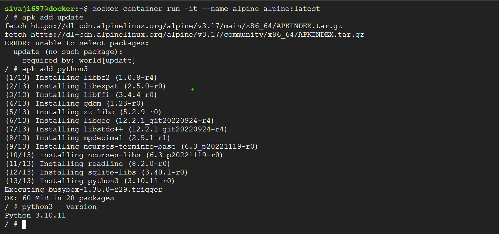

create an alpine container in interactive mode and install python
### ANS: `docker container run -it --name alpine -P alpine:3.0.0` && `apk add --update` && `apk add python3` && `python3`

create an ubuntu container with sllep 1d and then login using exec install pyhon 
### ANS: `docker container run -d --name py -P ubuntu:20.04 sleep 1d`,`docker container exec -it py /bin/bash`,`apt update`,`apt install python3` & `python3 --version` 
create a postgress container with user panoramic and password as trekking .try loggin and show the databases(query for the psql)
### ANS: ` docker container run -d --name database -e POSTGRES_USER=panoramic -e POSTGRES_PASSWORD=trekking -e POSTGRES_DB=psqldata -P postgres:15`,`docker exec -it database /bin/bash`,`psql --help`
 